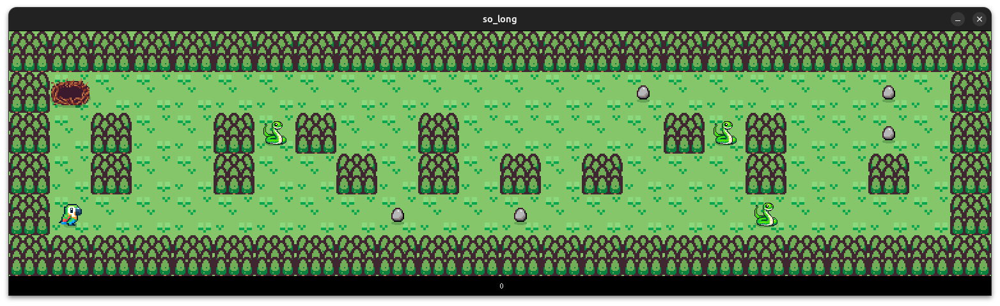

  

<h1 align="center">so_long</h1>

[Subject](srcs/en.subject.pdf)

&nbsp; This project is a mini-game in which we are only provided the basic tools to load and print images in the screen. The biggest challenge is to create our own API and sprites in order to build the game.

> [!IMPORTANT]
> It might be necessary to install some dependencies to make the MiniLibX work in your computer, see more [here](https://github.com/42Paris/minilibx-linux).

## Restrictions
&nbsp; We are only allowed to use the following functions:

* `open()`.
* `close()`.
* `read()`.
* `write()`.
* `malloc()`.
* `free()`.
* `exit()`.
* `perror()`.
* `strerror()`.
* All functions from the `math` library.
* All functions from the `MiniLibX` [library](https://github.com/42Paris/minilibx-linux).
* [Our own](https://github.com/ThalesXS/42-ft_printf) `ft_printf()`.
* [Our own](https://github.com/ThalesXS/42-libft) `libft` library.

## Usage

  

&nbsp; To execute the program, just run `make test`, if you possess all necessary dependecies, everything will be compiled as expected.

##### Movements

To move, use WASD (ZQSD in AZERTY keyboards) or &uarr;&larr;&darr;&rarr;.

##### Rules

You must collect all the eggs and return to the nest without touching the snakes!